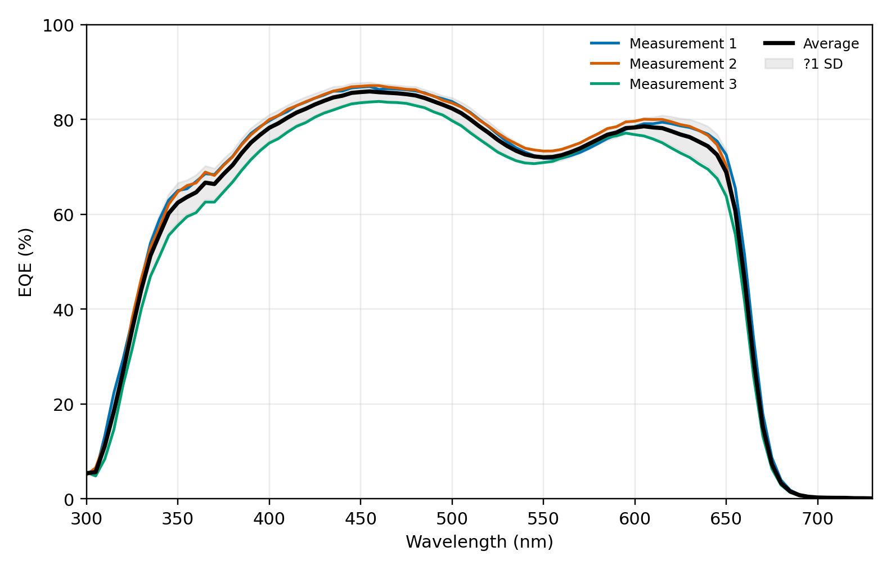
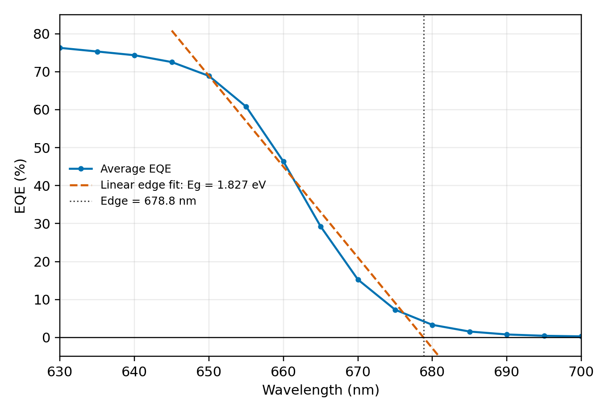

# Lab 2: Fabrication and Characterization of Perovskite Solar Cells

## Abstract

This experiment studied inverted p-i-n perovskite solar cells, with emphasis on device fabrication, layer functions, photovoltaic characterization, and external quantum efficiency (EQE) analysis. The lab manual introduced both normal-bandgap perovskite, Cs0.05FA0.902MA0.048PbI2.7Br0.3, and wide-bandgap perovskite, Cs0.25FA0.75Pb(Br0.5I0.5)3. The available experimental dataset was the wide-bandgap EQE measurement. Three EQE scans gave integrated AM1.5G short-circuit current densities of 13.946, 13.947, and 13.231 mA cm-2, with an average of 13.708 mA cm-2. The average EQE remained high across the visible region, with a mean value of 79.21% from 400 to 640 nm and a maximum EQE of about 85.93% near 457 nm. The absorption edge appeared near 679 nm by linear extrapolation, corresponding to an estimated bandgap of 1.827 eV. This result agrees well with the expected wide-bandgap composition of approximately 1.84 eV.

## 1. Introduction

Metal-halide perovskite solar cells are promising photovoltaic devices because they combine strong optical absorption, long carrier diffusion lengths, tunable bandgaps, and low-temperature solution processing. By changing the halide and cation composition, the bandgap can be adjusted for different applications. A normal-bandgap perovskite around 1.56 eV is well suited for efficient single-junction devices, while a wide-bandgap perovskite around 1.84 eV is important for tandem solar cells, especially as the top cell in perovskite/silicon or all-perovskite tandem architectures.

The device structure used in this lab is an inverted p-i-n structure based on ITO/glass, a hole transport layer, a perovskite absorber, an electron transport layer, a hole blocking layer, and a thermally evaporated metal electrode. The key characterization methods are current density-voltage measurement under AM1.5G illumination and EQE measurement using a calibrated spectral response system.

## 2. Experimental Method

ITO/glass substrates were cleaned sequentially in diluted detergent, deionized water, isopropanol, and ethanol for 15 min each. The pre-cleaned ITO substrates were treated by UV-ozone for 25 min to improve surface cleanliness and wettability before deposition of the hole transport layer.

The hole transport layer was a self-assembled monolayer, 4PADCB, prepared at 0.5 mg mL-1 in ethanol. It was spin-coated at 4000 rpm for 30 s and annealed at 120 degC for 10 min. The perovskite absorber was deposited from precursor solution by a two-step spin-coating process: 1000 rpm for 5 s followed by 4000 rpm for 30 s. During the second step, 160 uL of chlorobenzene anti-solvent was dropped at 11 s. The film was then annealed at 100 degC for 30 min.

The electron transport layer was PC61BM, spin-coated from a 20 mg mL-1 solution in chlorobenzene at 3000 rpm for 30 s. The hole blocking layer was BCP, spin-coated from a 0.5 mg mL-1 solution in isopropanol at 5000 rpm for 30 s. Finally, a metal electrode was deposited by thermal evaporation under vacuum through a shadow mask with an active area of 0.04 cm2. The lab manual schematic labels Au, while the fabrication procedure specifies 100 nm Ag; in either case, the top metal electrode functions as the back contact.

EQE spectra were measured with a Solar Cell Spectral Response Measurement System QE-R3011. The light intensity at each wavelength was calibrated using a standard single-crystal silicon photovoltaic cell. The measured wide-bandgap EQE files covered 300-730 nm under zero voltage bias.

## 3. Results

### 3.1 EQE Spectrum

The three WBG EQE measurements show consistent spectral behavior. The EQE rises quickly from the ultraviolet region, exceeds 80% over a broad visible range, and then decreases sharply near the long-wavelength absorption edge. The first two scans are almost identical, while the third scan has a slightly lower EQE across most wavelengths.

The AM1.5G-integrated Jsc values from the EQE files are summarized below.

| Measurement | Jsc from EQE (mA cm-2) | Mean EQE, 400-640 nm (%) | Maximum EQE (%) | Peak wavelength (nm) |
|---:|---:|---:|---:|---:|
| 1 | 13.946 | 80.025 | 86.904 | 455 |
| 2 | 13.947 | 80.625 | 87.117 | 455 |
| 3 | 13.231 | 76.977 | 83.773 | 460 |
| Average | 13.708 | 79.209 | 85.931 | 456.7 |
| Standard deviation | 0.413 | 1.956 | 1.872 | 2.9 |

The average integrated current density of 13.708 mA cm-2 is reasonable for a wide-bandgap perovskite because photons with wavelengths longer than the absorption edge are not absorbed efficiently. The relatively high plateau EQE indicates effective charge generation and collection in the visible region.

### 3.2 Bandgap Estimation from EQE

The optical bandgap was estimated from the long-wavelength EQE edge. A linear fit was applied to the steep falling edge between 650 and 680 nm, and the intercept with zero EQE was used as the absorption-edge wavelength. The average extrapolated edge was 678.79 nm, giving:

Eg = 1240 / lambda_edge = 1240 / 678.79 = 1.827 eV

The individual extrapolated bandgaps were 1.825, 1.828, and 1.828 eV. The mean value of 1.827 eV is close to the nominal 1.84 eV wide-bandgap perovskite composition. If a fixed 50% EQE threshold is used instead, the edge is around 658.69 nm and the apparent bandgap is 1.883 eV. This threshold method gives a slightly larger bandgap because it uses a point higher on the absorption edge rather than extrapolating to the onset.

## 4. Discussion

### 4.1 Functions of Each Layer

The ITO/glass substrate provides a transparent conducting front electrode. It allows incident light to enter the device while collecting charge carriers. The hole transport layer, 4PADCB, selectively extracts holes from the perovskite and blocks electrons, reducing interfacial recombination at the ITO side.

The perovskite absorber is the main photoactive layer. It absorbs photons, generates electron-hole pairs, and transports carriers toward the selective contacts. Its composition determines the bandgap, absorption edge, Voc potential, and current-generation range. The PC61BM electron transport layer extracts electrons from the perovskite and blocks holes. It also helps passivate the perovskite surface and improves electron collection. The BCP hole blocking layer further suppresses hole transport toward the metal electrode and improves contact selectivity. The evaporated metal electrode collects electrons and completes the external circuit.

### 4.2 Purpose of the Anti-Solvent

The anti-solvent, chlorobenzene, is dropped during the fast spin-coating stage to rapidly remove the host solvent from the wet perovskite film. This sudden solvent extraction creates quick supersaturation of the precursor solution, promotes dense nucleation, and helps form a uniform intermediate film. After annealing, this leads to a smoother and more compact perovskite layer with fewer pinholes. A good anti-solvent process is important because film morphology strongly affects charge transport, shunt resistance, leakage current, and overall device reproducibility.

### 4.3 Comparison Between Normal-Bandgap and Wide-Bandgap Perovskites

Normal-bandgap perovskites usually give higher PCE and higher Jsc than wide-bandgap perovskites because they absorb a larger part of the solar spectrum. A 1.56 eV absorber can harvest more red and near-infrared photons, so its photocurrent is higher. In contrast, a 1.84 eV wide-bandgap absorber stops absorbing at a shorter wavelength, which limits Jsc. This behavior is consistent with the WBG EQE data: the EQE falls rapidly beyond about 660-680 nm, so longer-wavelength photons do not contribute much current.

However, wide-bandgap perovskites generally produce higher Voc because a larger bandgap increases the maximum possible separation between the electron and hole quasi-Fermi levels. Normal-bandgap devices therefore often show the tradeoff of higher Jsc but lower Voc. The final PCE depends on the balance between Jsc, Voc, and fill factor. In many single-junction cases, the gain in current for the normal-bandgap device is large enough that the normal-bandgap cell achieves higher PCE.

### 4.4 Application of Wide-Bandgap Perovskite Solar Cells

Wide-bandgap perovskite solar cells are especially useful as top cells in tandem photovoltaics. In a tandem design, the wide-bandgap top cell absorbs high-energy visible photons and transmits lower-energy photons to a bottom cell, such as silicon or a narrow-bandgap perovskite. This spectral splitting can reduce thermalization loss and raise the theoretical efficiency beyond the single-junction limit. Wide-bandgap perovskites are also useful in semi-transparent photovoltaics and building-integrated photovoltaic windows, where partial visible-light transmission may be desired.

### 4.5 Interpretation of the Measured WBG EQE

The measured WBG EQE spectra show a broad high-response region from approximately 400 to 640 nm, which means that the device can efficiently convert visible photons into collected charge carriers. The sharp EQE decline near the absorption edge confirms the wide-bandgap nature of the absorber. The average bandgap estimated by linear extrapolation is 1.827 eV, close to the expected 1.84 eV value for Cs0.25FA0.75Pb(Br0.5I0.5)3. The small difference may come from the fitting method, composition variation, film inhomogeneity, Urbach tail absorption, or measurement uncertainty near the weak-response edge.

The third scan gives a lower integrated Jsc and lower EQE plateau than the first two scans. This may reflect measurement-position variation, slight device nonuniformity, optical alignment differences, or local degradation during measurement. Even with this variation, all three spectra preserve the same absorption edge and therefore give nearly identical bandgap estimates by linear extrapolation.

## 5. Conclusion

In this lab, the fabrication and characterization principles of inverted p-i-n perovskite solar cells were studied. The measured wide-bandgap EQE data gave an average AM1.5G-integrated Jsc of 13.708 mA cm-2 and an average EQE of 79.21% between 400 and 640 nm. The EQE edge analysis gave an estimated bandgap of 1.827 eV, which agrees well with the expected 1.84 eV wide-bandgap perovskite. Compared with normal-bandgap perovskites, wide-bandgap absorbers generate lower Jsc because they absorb fewer long-wavelength photons, but they can provide higher Voc and are highly valuable for tandem solar cell applications.

## References

1. EE336 Fundamentals of Photovoltaics, Lab 2: Fabrication and Characterization of Perovskite Solar Cells.
2. WBG-EQE measurement files: C-3_Save_All Data.txt and C-2_Save_All Data_Save_All Data.txt.

