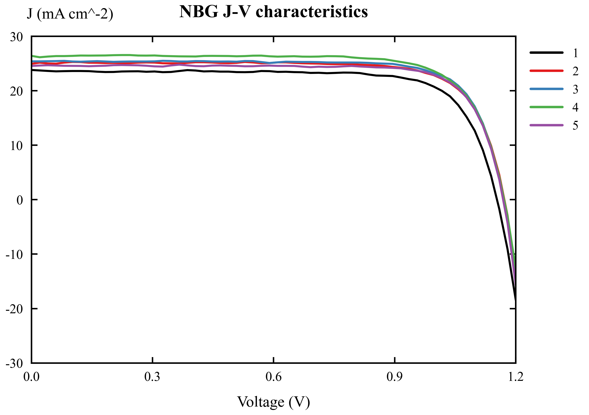
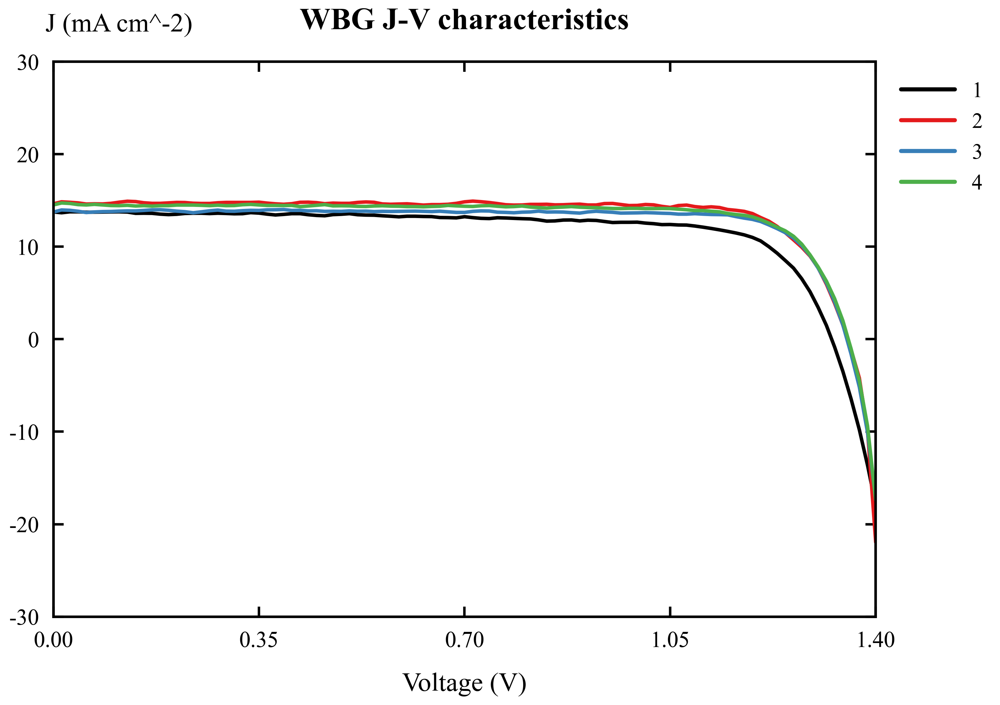
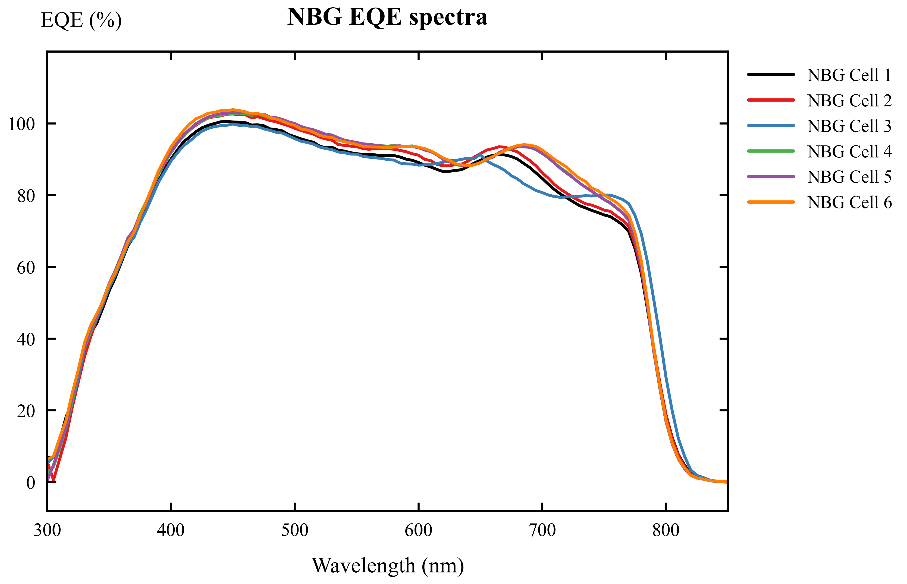
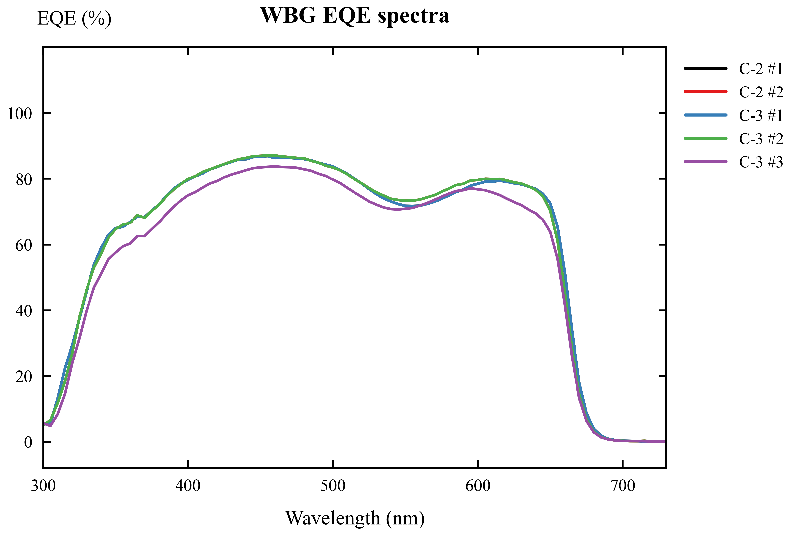

# Lab 2: Fabrication and Characterization of Perovskite Solar Cells  
# 实验二：钙钛矿太阳能电池的制备与表征

## Abstract / 摘要

**English.** This experiment focuses on the fabrication and characterization of inverted p-i-n perovskite solar cells. The lab includes normal-bandgap perovskite, Cs0.05FA0.902MA0.048PbI2.7Br0.3, and wide-bandgap perovskite, Cs0.25FA0.75Pb(Br0.5I0.5)3. Based on the provided J-V and EQE data, the normal-bandgap devices show higher short-circuit current density and higher power conversion efficiency, while the wide-bandgap devices show higher open-circuit voltage. From the Origin-style J-V curves, the average estimated performance is JSC = 25.03 mA cm-2, VOC = 1.167 V, FF = 0.777, and PCE = 22.70% for the normal-bandgap cells, and JSC = 14.17 mA cm-2, VOC = 1.345 V, FF = 0.797, and PCE = 15.22% for the wide-bandgap cells. From the EQE absorption edges, the estimated bandgaps are approximately 1.56 eV for the normal-bandgap perovskite and approximately 1.83 eV for the wide-bandgap perovskite.

**中文。** 本实验研究倒置 p-i-n 结构钙钛矿太阳能电池的制备与表征。实验涉及正常带隙钙钛矿 Cs0.05FA0.902MA0.048PbI2.7Br0.3 和宽带隙钙钛矿 Cs0.25FA0.75Pb(Br0.5I0.5)3。根据提供的 J-V 与 EQE 数据，正常带隙器件具有更高的短路电流密度和更高的光电转换效率，而宽带隙器件具有更高的开路电压。由 Origin 风格 J-V 曲线估算，正常带隙电池的平均性能约为 JSC = 25.03 mA cm-2、VOC = 1.167 V、FF = 0.777、PCE = 22.70%；宽带隙电池的平均性能约为 JSC = 14.17 mA cm-2、VOC = 1.345 V、FF = 0.797、PCE = 15.22%。由 EQE 吸收边估算，正常带隙钙钛矿的带隙约为 1.56 eV，宽带隙钙钛矿的带隙约为 1.83 eV。

## 1. Introduction / 引言

**English.** Metal-halide perovskite solar cells have attracted great attention because they combine strong optical absorption, tunable bandgap, long carrier diffusion length, and low-temperature solution processing. By changing the halide composition, especially the I/Br ratio, the bandgap can be tuned from a normal-bandgap value suitable for high-current single-junction devices to a wide-bandgap value suitable for tandem solar cells.

**中文。** 金属卤化物钙钛矿太阳能电池因其强光吸收、可调带隙、较长载流子扩散长度以及低温溶液加工等优点而受到广泛关注。通过调节卤素组成，尤其是 I/Br 比例，可以将带隙从适合高电流单结器件的正常带隙调节到适合叠层太阳能电池的宽带隙。

**English.** In this lab, the device structure is an inverted p-i-n configuration: ITO/glass / hole transport layer / perovskite absorber / electron transport layer / hole blocking layer / metal electrode. The main characterization methods are J-V measurement under AM1.5G illumination and external quantum efficiency measurement.

**中文。** 本实验器件采用倒置 p-i-n 结构：ITO 玻璃 / 空穴传输层 / 钙钛矿吸收层 / 电子传输层 / 空穴阻挡层 / 金属电极。主要表征方法包括 AM1.5G 光照下的 J-V 测试和外量子效率 EQE 测试。

## 2. Working Principle / 工作原理

**English.** A perovskite solar cell converts light into electrical energy through photon absorption, charge generation, charge separation, and charge collection. When incident photons with energy higher than the perovskite bandgap enter the device, they are absorbed by the perovskite layer and generate electron-hole pairs. Because metal-halide perovskites have relatively low exciton binding energy, these photogenerated carriers can be separated efficiently at room temperature.

**中文。** 钙钛矿太阳能电池通过光子吸收、载流子产生、载流子分离和载流子收集将光能转化为电能。当能量高于钙钛矿带隙的入射光子进入器件后，会被钙钛矿吸收层吸收并产生电子-空穴对。由于金属卤化物钙钛矿的激子结合能较低，这些光生载流子在室温下可以较容易地分离。

**English.** In the inverted p-i-n device, selective transport layers drive the photogenerated carriers toward different electrodes. Holes are extracted by the hole transport layer and collected by the ITO front electrode, while electrons are extracted by PC61BM and collected by the top metal electrode. The selective contacts suppress carrier recombination and help maintain a high quasi-Fermi-level splitting, which determines the open-circuit voltage. The photocurrent under short-circuit conditions is mainly determined by the absorption range, EQE, and charge-collection efficiency.

**中文。** 在倒置 p-i-n 器件中，选择性传输层将光生载流子引导到不同电极。空穴由空穴传输层提取并被 ITO 前电极收集，电子由 PC61BM 提取并被顶部金属电极收集。选择性接触可以抑制载流子复合，并维持较高的准费米能级分裂，从而影响开路电压。短路条件下的光电流主要由吸收光谱范围、EQE 和载流子收集效率决定。

**English.** The main photovoltaic parameters are JSC, VOC, FF, and PCE. JSC represents the collected current density at zero voltage. VOC is the voltage at zero net current and is strongly related to the absorber bandgap and recombination loss. FF reflects the squareness of the J-V curve and is affected by series resistance, shunt resistance, and diode quality. PCE is calculated from PCE = JSC x VOC x FF / Pin, where Pin is the incident light power density.

**中文。** 主要光伏参数包括 JSC、VOC、FF 和 PCE。JSC 表示零偏压下收集到的电流密度；VOC 表示净电流为零时的电压，并与吸收层带隙和复合损失密切相关；FF 反映 J-V 曲线的方正程度，受串联电阻、并联电阻和二极管质量影响；PCE 由 PCE = JSC x VOC x FF / Pin 计算，其中 Pin 为入射光功率密度。

## 3. Device Architecture / 器件结构

**English.** The device used in this experiment is an inverted positive-intrinsic-negative, or p-i-n, perovskite solar cell. The layer sequence is ITO/glass / 4PADCB / perovskite / PC61BM / BCP / metal electrode. Light enters from the ITO/glass side, passes through the transparent conducting substrate and the ultrathin hole transport layer, and is absorbed mainly by the perovskite film.

**中文。** 本实验器件采用倒置 positive-intrinsic-negative，即 p-i-n，钙钛矿太阳能电池结构。器件层状顺序为 ITO 玻璃 / 4PADCB / 钙钛矿 / PC61BM / BCP / 金属电极。光从 ITO 玻璃一侧入射，穿过透明导电基底和超薄空穴传输层，主要在钙钛矿薄膜中被吸收。

**English.** ITO/glass serves as the transparent front electrode and mechanical substrate. 4PADCB is a self-assembled monolayer hole transport layer that improves hole extraction and interfacial selectivity. The perovskite layer is the intrinsic absorber, and its composition determines whether the device is normal-bandgap or wide-bandgap. PC61BM acts as the electron transport layer, BCP acts as a hole blocking layer, and the evaporated metal electrode works as the back contact for electron collection.

**中文。** ITO 玻璃同时作为透明前电极和机械支撑基底。4PADCB 是自组装单分子空穴传输层，用于改善空穴提取和界面选择性。钙钛矿层是本征吸收层，其组成决定器件属于正常带隙还是宽带隙。PC61BM 作为电子传输层，BCP 作为空穴阻挡层，蒸镀金属电极作为背电极用于收集电子。

**English.** This architecture is different from a conventional n-i-p device because the hole-selective contact is placed at the illuminated ITO side and the electron-selective contact is placed near the top metal electrode. This inverted structure is commonly used in perovskite devices because it can be processed at relatively low temperature, is compatible with self-assembled monolayers, and is suitable for tandem solar cell integration.

**中文。** 该结构不同于常规 n-i-p 器件，因为空穴选择性接触位于受光的 ITO 一侧，而电子选择性接触位于顶部金属电极附近。倒置结构常用于钙钛矿器件，因为它可在较低温度下制备，兼容自组装单分子层，并适合叠层太阳能电池集成。

### 3.1 Functions of Each Layer / 各层结构及功能

| Layer / 层结构 | Material / 材料 | Function / 功能 |
|---|---|---|
| Transparent front electrode and substrate / 透明前电极与基底 | ITO/glass / ITO 玻璃 | **English:** Provides mechanical support and transparent electrical contact. It allows light to enter from the front side and collects holes in the inverted p-i-n device. **中文：** 提供机械支撑和透明导电接触，使光从前侧进入器件，并在倒置 p-i-n 结构中收集空穴。 |
| Hole transport layer, HTL / 空穴传输层 | 4PADCB self-assembled monolayer / 4PADCB 自组装单分子层 | **English:** Selectively extracts holes, blocks electrons, improves ITO/perovskite interface contact, and reduces interfacial recombination. **中文：** 选择性提取空穴并阻挡电子，改善 ITO/钙钛矿界面接触，降低界面复合。 |
| Perovskite absorber / 钙钛矿吸收层 | NBG: Cs0.05FA0.902MA0.048PbI2.7Br0.3; WBG: Cs0.25FA0.75Pb(Br0.5I0.5)3 | **English:** Absorbs incident photons, generates electron-hole pairs, and determines the absorption edge, JSC, and VOC potential through its bandgap. **中文：** 吸收入射光子并产生电子-空穴对，其带隙决定吸收边、JSC 和 VOC 潜力。 |
| Electron transport layer, ETL / 电子传输层 | PC61BM | **English:** Selectively extracts electrons from the perovskite and blocks holes, improving electron collection and suppressing recombination near the back contact. **中文：** 从钙钛矿中选择性提取电子并阻挡空穴，提高电子收集效率并抑制背接触附近复合。 |
| Hole blocking layer / 空穴阻挡层 | BCP | **English:** Blocks holes from reaching the metal electrode, improves electron-selective contact, and helps reduce leakage and interfacial recombination. **中文：** 阻挡空穴到达金属电极，改善电子选择性接触，并有助于降低漏电和界面复合。 |
| Back metal electrode / 背金属电极 | Evaporated Ag or Au / 蒸镀 Ag 或 Au | **English:** Collects electrons from the ETL side and completes the external circuit. **中文：** 从电子传输层一侧收集电子，并构成完整外电路。 |

## 4. Experimental Method / 实验方法

**English.** ITO/glass substrates were sequentially cleaned in diluted detergent, deionized water, isopropanol, and ethanol for 15 min each. Before depositing the hole transport layer, the cleaned substrates were treated by UV-ozone for 25 min. The 4PADCB self-assembled monolayer was spin-coated at 4000 rpm for 30 s and annealed at 120 degC for 10 min.

**中文。** ITO 玻璃基底依次在稀释洗涤剂、去离子水、异丙醇和乙醇中超声清洗，每步 15 min。沉积空穴传输层之前，清洗后的基底经过 25 min 紫外臭氧处理。4PADCB 自组装单分子层以 4000 rpm 旋涂 30 s，并在 120 degC 退火 10 min。

**English.** The perovskite precursor was deposited by a two-step spin-coating process: 1000 rpm for 5 s and then 4000 rpm for 30 s. During the second stage, 160 uL chlorobenzene was dropped as the anti-solvent at 11 s. The film was then annealed at 100 degC for 30 min. PC61BM was spin-coated as the electron transport layer, BCP was spin-coated as the hole blocking layer, and a metal electrode was thermally evaporated through a shadow mask.

**中文。** 钙钛矿前驱体采用两步旋涂工艺沉积：1000 rpm 旋涂 5 s，随后 4000 rpm 旋涂 30 s。在第二阶段第 11 s 滴加 160 uL 氯苯作为反溶剂，随后薄膜在 100 degC 退火 30 min。PC61BM 作为电子传输层旋涂，BCP 作为空穴阻挡层旋涂，最后通过掩膜热蒸发金属电极。

### 4.1 Purpose of Each Fabrication Step / 制备步骤及作用

| Step / 步骤 | Process / 操作 | Purpose / 作用 |
|---:|---|---|
| 1 | Substrate cleaning in detergent, DI water, IPA, and ethanol / 使用洗涤剂、去离子水、异丙醇和乙醇依次清洗基底 | **English:** Removes dust, organic residues, ions, and grease from the ITO surface, reducing shunts and improving film uniformity. **中文：** 去除 ITO 表面的灰尘、有机残留、离子和油污，减少短路通道并提高薄膜均匀性。 |
| 2 | UV-ozone treatment / 紫外臭氧处理 | **English:** Further removes organic contamination, increases ITO surface energy, improves wettability, and promotes uniform HTL coating. **中文：** 进一步去除有机污染，提高 ITO 表面能和润湿性，促进空穴传输层均匀铺展。 |
| 3 | Spin-coating 4PADCB HTL / 旋涂 4PADCB 空穴传输层 | **English:** Forms a hole-selective interface that extracts holes and blocks electrons at the illuminated electrode side. **中文：** 形成空穴选择性界面，在受光电极侧提取空穴并阻挡电子。 |
| 4 | Annealing the HTL at 120 degC / 120 degC 退火空穴传输层 | **English:** Improves molecular ordering, adhesion, and interfacial contact between ITO and the following perovskite layer. **中文：** 改善分子排列、附着力以及 ITO 与后续钙钛矿层之间的界面接触。 |
| 5 | First stage perovskite spin coating at 1000 rpm / 第一阶段 1000 rpm 旋涂钙钛矿前驱液 | **English:** Spreads the precursor solution across the substrate and forms an initial wet film. **中文：** 将前驱体溶液铺展在基底表面，形成初始湿膜。 |
| 6 | Second stage spin coating at 4000 rpm / 第二阶段 4000 rpm 高速旋涂 | **English:** Thins the wet film, removes excess solvent, and helps define the final film thickness and uniformity. **中文：** 使湿膜变薄、去除多余溶剂，并决定最终薄膜厚度和均匀性。 |
| 7 | Chlorobenzene anti-solvent dripping / 滴加氯苯反溶剂 | **English:** Rapidly extracts solvent, induces supersaturation and nucleation, and promotes a compact perovskite intermediate film with fewer pinholes. **中文：** 快速抽提溶剂，诱导过饱和和成核，促进形成致密且针孔较少的钙钛矿中间膜。 |
| 8 | Perovskite annealing at 100 degC / 100 degC 退火钙钛矿薄膜 | **English:** Converts the intermediate film into crystalline perovskite, improves grain formation, and enhances charge transport. **中文：** 将中间膜转化为结晶钙钛矿，改善晶粒形成并增强载流子传输。 |
| 9 | Spin-coating PC61BM ETL / 旋涂 PC61BM 电子传输层 | **English:** Forms an electron-selective contact, extracts electrons, blocks holes, and passivates the perovskite surface. **中文：** 形成电子选择性接触，提取电子、阻挡空穴，并对钙钛矿表面起到一定钝化作用。 |
| 10 | Spin-coating BCP hole blocking layer / 旋涂 BCP 空穴阻挡层 | **English:** Suppresses hole leakage to the metal electrode and improves the selectivity of the back contact. **中文：** 抑制空穴泄漏到金属电极，提高背接触的选择性。 |
| 11 | Thermal evaporation of metal electrode through a shadow mask / 通过掩膜热蒸发金属电极 | **English:** Deposits the back electrode, defines the active device area, and completes the current-collection pathway. **中文：** 沉积背电极，定义器件有效面积，并完成电流收集路径。 |

## 5. Results / 结果

### 5.1 J-V Characteristics / J-V 特性

**English.** The J-V curves show the typical diode behavior of photovoltaic devices. The normal-bandgap cells provide higher photocurrent, while the wide-bandgap cells provide higher voltage. This trend agrees with the expected bandgap-current-voltage tradeoff.

**中文。** J-V 曲线表现出典型光伏二极管行为。正常带隙电池具有更高的光电流，而宽带隙电池具有更高的电压。这一趋势符合带隙、电流和电压之间的基本权衡关系。

| Device | JSC (mA cm-2) | VOC (V) | FF | PCE (%) |
|---|---:|---:|---:|---:|
| Normal-bandgap, average | 25.03 | 1.167 | 0.777 | 22.70 |
| Normal-bandgap, standard deviation | 0.97 | 0.008 | 0.014 | 1.04 |
| Wide-bandgap, average | 14.17 | 1.345 | 0.797 | 15.22 |
| Wide-bandgap, standard deviation | 0.48 | 0.014 | 0.043 | 1.25 |

**English.** These values were estimated from the provided Origin-style J-V curves. Under 100 mW cm-2 illumination, the maximum output power density in mW cm-2 is numerically equal to PCE in percent.

**中文。** 表中数值由提供的 Origin 风格 J-V 曲线估算得到。在 100 mW cm-2 光照条件下，最大输出功率密度的数值 mW cm-2 与 PCE 的百分数数值相等。

### 5.2 EQE Spectra and Bandgap / EQE 光谱与带隙

**English.** The EQE spectra show that the normal-bandgap perovskite absorbs to longer wavelengths, while the wide-bandgap perovskite has an earlier absorption cutoff. Therefore, the normal-bandgap device can collect more red photons and generates a larger JSC.

**中文。** EQE 光谱显示，正常带隙钙钛矿可以吸收到更长波长，而宽带隙钙钛矿的吸收截止波长更短。因此，正常带隙器件能够收集更多红光光子，从而产生更高的 JSC。

| Device | Linear absorption edge (nm) | Bandgap from linear edge (eV) | 50% EQE edge (nm) | Bandgap from 50% edge (eV) | Final reported bandgap |
|---|---:|---:|---:|---:|---|
| Normal-bandgap | 812.35 | 1.526 | 785.58 | 1.578 | about 1.56 eV |
| Wide-bandgap | 676.95 | 1.832 | 659.02 | 1.882 | about 1.83 eV |

**English.** The bandgap was estimated using Eg = 1240 / lambda_edge, where Eg is in eV and lambda_edge is in nm. For the wide-bandgap raw EQE export in the WBG-EQE folder, linear extrapolation gives an absorption edge of 678.79 nm and Eg = 1.827 eV, which is very close to the Origin-figure estimate of about 1.83 eV.

**中文。** 带隙采用 Eg = 1240 / lambda_edge 估算，其中 Eg 单位为 eV，lambda_edge 单位为 nm。对于 WBG-EQE 文件夹中的宽带隙原始 EQE 导出数据，线性外推得到吸收边约为 678.79 nm，对应 Eg = 1.827 eV，与 Origin 图估算的约 1.83 eV 非常接近。

## 6. Explicit Answers to Discussion Topics / 讨论题逐条回答

### Question 1. What are the functions of each layer in the perovskite solar cell?  
### 问题 1：钙钛矿太阳能电池中各层的功能是什么？

**English.** ITO/glass is the transparent conducting substrate. It allows light to enter the device and collects carriers at the front contact. The HTL, 4PADCB, selectively extracts holes and blocks electrons, reducing interfacial recombination at the ITO side. The perovskite layer is the light absorber; it generates electron-hole pairs and transports carriers. The ETL, PC61BM, selectively extracts electrons and blocks holes. BCP works as a hole blocking layer and improves electron-selective contact with the metal electrode. The metal electrode collects electrons and closes the external circuit.

**中文。** ITO 玻璃是透明导电基底，既允许光进入器件，又作为前电极收集载流子。空穴传输层 4PADCB 选择性提取空穴并阻挡电子，从而降低 ITO 界面的复合。钙钛矿层是主要吸光层，负责吸收光子、产生电子-空穴对并传输载流子。电子传输层 PC61BM 选择性提取电子并阻挡空穴。BCP 作为空穴阻挡层，可以改善金属电极侧的电子选择性接触。金属电极负责收集电子并构成外电路。

### Question 2. What is the purpose of anti-solvent during the perovskite film deposition?  
### 问题 2：钙钛矿薄膜沉积过程中反溶剂的作用是什么？

**English.** The anti-solvent, chlorobenzene, rapidly extracts the host solvent from the wet precursor film during spin coating. This causes fast supersaturation and nucleation, helps form a compact and uniform intermediate film, and reduces pinholes after annealing. A good anti-solvent step improves film morphology, carrier transport, shunt resistance, and device reproducibility.

**中文。** 反溶剂氯苯在旋涂过程中可以快速抽提出湿膜中的主溶剂，使前驱体溶液迅速过饱和并成核，从而形成致密、均匀的中间薄膜，并在退火后减少针孔。良好的反溶剂工艺可以改善薄膜形貌、载流子传输、并联电阻和器件重复性。

### Question 3. Why does the normal-bandgap perovskite give higher PCE and JSC, but lower VOC than the wide-bandgap perovskite?  
### 问题 3：为什么正常带隙钙钛矿的 PCE 和 JSC 更高，但 VOC 低于宽带隙钙钛矿？

**English.** The normal-bandgap perovskite has a smaller bandgap, so it absorbs longer-wavelength photons and uses a larger part of the solar spectrum. Therefore, it gives a higher JSC. In the measured curves, the normal-bandgap cells have an average JSC of about 25.03 mA cm-2, much higher than the wide-bandgap average of about 14.17 mA cm-2. This larger current also leads to a higher PCE for the normal-bandgap cells. However, VOC is limited by the absorber bandgap. A wide-bandgap absorber can provide a larger quasi-Fermi-level splitting, so the wide-bandgap cells show a higher VOC of about 1.345 V, compared with about 1.167 V for the normal-bandgap cells.

**中文。** 正常带隙钙钛矿的带隙较小，可以吸收更长波长的光子，因此能够利用更大范围的太阳光谱，产生更高的 JSC。在实测曲线估算中，正常带隙电池的平均 JSC 约为 25.03 mA cm-2，明显高于宽带隙电池的约 14.17 mA cm-2。更高的电流也使正常带隙电池具有更高的 PCE。然而，VOC 受吸收层带隙限制。宽带隙材料能够提供更大的准费米能级分裂，因此宽带隙电池的 VOC 更高，约为 1.345 V，而正常带隙电池约为 1.167 V。

### Question 4. What is the application of wide-bandgap perovskite solar cell?  
### 问题 4：宽带隙钙钛矿太阳能电池的应用是什么？

**English.** Wide-bandgap perovskite solar cells are mainly used as top cells in tandem photovoltaics. In a perovskite/silicon tandem or all-perovskite tandem cell, the wide-bandgap top cell absorbs high-energy visible photons and transmits lower-energy photons to the bottom cell. This spectral splitting reduces thermalization loss and can increase efficiency beyond the single-junction limit. Wide-bandgap perovskites can also be used in semi-transparent and building-integrated photovoltaic devices.

**中文。** 宽带隙钙钛矿太阳能电池最主要的应用是作为叠层光伏器件中的顶电池。在钙钛矿/硅叠层或全钙钛矿叠层电池中，宽带隙顶电池吸收高能可见光光子，并让较低能量的光子透过到底电池。这种光谱分配可以降低热化损失，使效率超过单结电池极限。宽带隙钙钛矿还可用于半透明光伏和建筑集成光伏器件。

### Question 5. What are the estimated bandgaps of the perovskites based on the measured EQE spectra?  
### 问题 5：根据测得的 EQE 光谱，钙钛矿的估算带隙是多少？

**English.** The bandgap was estimated from the EQE absorption edge using Eg = 1240 / lambda_edge. For the normal-bandgap perovskite, the EQE edge gives a bandgap around 1.53 eV by linear extrapolation and around 1.58 eV by the 50% EQE method. Therefore, the normal-bandgap perovskite is reported as approximately 1.56 eV. For the wide-bandgap perovskite, the linear edge gives approximately 1.83 eV. The raw WBG-EQE data give Eg = 1.827 eV, so the wide-bandgap perovskite is reported as approximately 1.83 eV, close to the nominal 1.84 eV.

**中文。** 带隙通过 EQE 吸收边公式 Eg = 1240 / lambda_edge 估算。对于正常带隙钙钛矿，线性外推得到的带隙约为 1.53 eV，50% EQE 截止法得到的带隙约为 1.58 eV，因此可报告为约 1.56 eV。对于宽带隙钙钛矿，线性吸收边得到的带隙约为 1.83 eV；WBG-EQE 原始数据计算得到 Eg = 1.827 eV，因此可报告为约 1.83 eV，接近讲义中的标称值 1.84 eV。

## 7. Conclusion / 结论

**English.** The inverted p-i-n perovskite solar cells were analyzed using J-V and EQE data. The normal-bandgap device shows higher JSC and PCE because it absorbs a wider spectral range, especially longer-wavelength photons. The wide-bandgap device shows higher VOC because its larger bandgap allows a larger photovoltage. Based on the measured EQE spectra, the estimated bandgaps are approximately 1.56 eV for the normal-bandgap perovskite and approximately 1.83 eV for the wide-bandgap perovskite. These values are consistent with the compositions given in the lab manual.

**中文。** 本实验利用 J-V 和 EQE 数据分析了倒置 p-i-n 钙钛矿太阳能电池。正常带隙器件能够吸收更宽的光谱范围，特别是更长波长光子，因此具有更高的 JSC 和 PCE。宽带隙器件由于带隙更大，可以产生更高的 VOC。根据测得的 EQE 光谱，正常带隙钙钛矿的估算带隙约为 1.56 eV，宽带隙钙钛矿的估算带隙约为 1.83 eV。这些结果与实验讲义中给出的材料组成和标称带隙一致。

## References / 参考文献

1. EE336 Fundamentals of Photovoltaics, Lab 2: Fabrication and Characterization of Perovskite Solar Cells.
2. WBG-EQE measurement files: C-3_Save_All Data.txt and C-2_Save_All Data_Save_All Data.txt.
3. Origin-style figures in the report_artifacts folder: NBG/WBG J-V and EQE curves.
