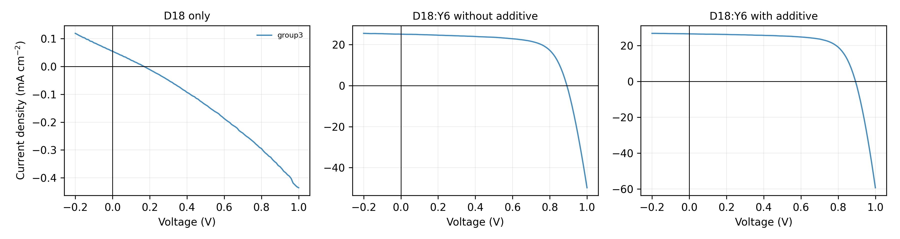
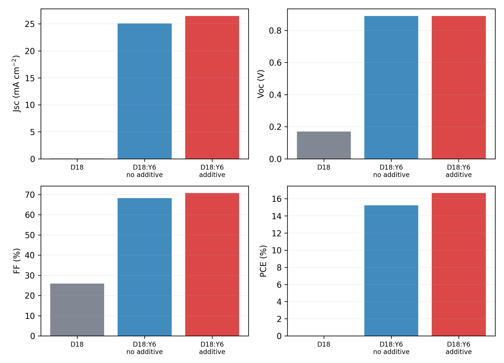
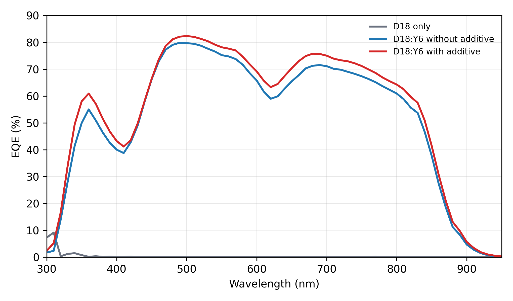
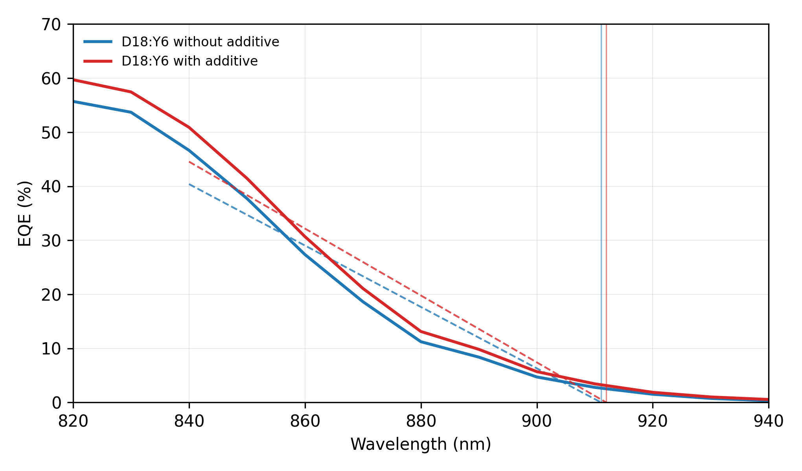

# Lab 3: Fabrication and Characterization of Organic Photovoltaic Devices

## Abstract

This experiment investigated organic photovoltaic (OPV) devices fabricated on patterned ITO/glass substrates with the structure ITO/PEDOT:PSS/active layer/PDINN/Ag. Three active-layer conditions were compared using the group3 J-V data only: D18 only, D18:Y6 without additive, and D18:Y6 with additive. The D18-only control showed almost no photovoltaic response, with a PCE of 0.0024%. In contrast, the D18:Y6 bulk heterojunction devices reached PCE values of 15.24% without additive and 16.67% with additive. The additive increased the short-circuit current density from 25.09 to 26.47 mA cm^-2 and improved the fill factor from 68.24% to 70.74%. EQE analysis gave integrated current densities of 20.60 and 21.72 mA cm^-2 for the blend devices without and with additive, respectively. These results show that acceptor blending and additive-assisted morphology optimization are essential for efficient OPV operation.

## 1. Introduction

Organic photovoltaics convert sunlight into electrical energy using conjugated organic semiconductors. Compared with inorganic photovoltaic technologies, OPVs can be processed from solution at low temperature and are attractive for lightweight, flexible, and semi-transparent solar modules. Their performance strongly depends on the electronic structure and nanoscale morphology of the active layer.

In this lab, D18 was used as the polymer donor and Y6 as the non-fullerene acceptor. A D18-only device was fabricated as a control, while D18:Y6 blend devices were prepared with and without additive. The comparison demonstrates why a donor-acceptor bulk heterojunction is needed and how processing additives can improve OPV performance.

## 2. Working Principle

In an OPV device, photons are absorbed by the active organic semiconductor layer and generate bound excitons rather than immediately free carriers. Because organic materials have relatively low dielectric constants, the exciton binding energy is large. Efficient photocurrent therefore requires a donor-acceptor interface where the exciton can dissociate: the donor preferentially transports holes, while the acceptor preferentially transports electrons.

The D18:Y6 blend forms a bulk heterojunction, which distributes donor-acceptor interfaces throughout the film. This shortens the distance excitons must diffuse before reaching an interface and creates percolated pathways for holes and electrons. PEDOT:PSS extracts holes at the ITO side, PDINN extracts electrons at the Ag side, and the Ag electrode completes the external circuit.

## 3. Device Architecture

The device architecture used in this experiment is:

ITO/glass / PEDOT:PSS / active layer / PDINN / Ag

ITO/glass serves as the transparent conducting substrate. PEDOT:PSS is the hole transport layer and improves hole extraction from the active layer. The active layer is either D18 only or a D18:Y6 blend. PDINN works as the electron transport layer and interfacial modifier near the metal electrode. The thermally evaporated Ag layer is the top electrode.

### 3.1 Functions of Each Layer in the OPV Device

| Layer | Material | Function |
|---|---|---|
| Transparent front electrode / substrate | Patterned ITO/glass | Provides mechanical support and a transparent conducting contact. Light enters through this side, and holes are collected through the ITO/PEDOT:PSS contact. |
| Hole transport layer (HTL) | PEDOT:PSS | Smooths the ITO surface, selectively extracts holes, blocks electrons, and reduces the injection/extraction barrier at the anode side. |
| Active layer | D18 only or D18:Y6 blend | Absorbs photons and generates excitons. In D18:Y6 devices, the donor-acceptor bulk heterojunction provides interfaces for exciton dissociation and pathways for hole/electron transport. |
| Electron transport/interfacial layer (ETL) | PDINN | Selectively extracts electrons, modifies the cathode interface, lowers contact resistance, and helps block holes from reaching the Ag electrode. |
| Back metal electrode | Ag, 100 nm | Collects electrons from the ETL side, defines the top contact, and completes the external circuit. |

## 4. Experimental Method

Patterned ITO/glass substrates were cleaned by sequential sonication in detergent water, deionized water, and absolute ethanol for 15 min each. The substrates were dried with an air gun and stored at 60 degC for 1 h before use. Before film deposition, the substrates were treated by UV-ozone for 20 min to remove residual organic contamination and improve surface wettability.

The active-layer solutions were prepared using chloroform as solvent. Three device conditions were fabricated: D18:Y6 with a 1:1.2 donor-to-acceptor ratio without additive, D18:Y6 with additive, and D18 only. PEDOT:PSS was spin-coated at 4000 rpm as the hole transport layer. The active layers were spin-coated inside the glovebox at 3000 rpm and then thermally annealed. PDINN was spin-coated at 3000 rpm as the electron transport layer. Finally, the samples were masked and loaded into a thermal evaporator for deposition of 100 nm Ag. Device performance was measured under a solar simulator, and EQE spectra were measured from 300 to 950 nm.

### 4.1 Purpose of Each Fabrication Step

| Step | Process | Purpose / analysis |
|---:|---|---|
| 1 | Sonication in detergent water for 15 min | Removes dust, grease, and loosely attached organic residues from patterned ITO/glass. This reduces shunting pathways and improves the reproducibility of later coating steps. |
| 2 | Sonication in deionized water for 15 min | Rinses away detergent residues and soluble ionic contaminants. A cleaner ITO surface helps avoid leakage current and interfacial recombination. |
| 3 | Sonication in absolute ethanol for 15 min | Further removes organic residues and promotes rapid drying. Ethanol is volatile and helps leave a cleaner substrate surface before thermal drying. |
| 4 | Air-gun drying and storage at 60 degC for 1 h | Removes residual solvent and moisture from the substrate. Dry substrates are important for uniform PEDOT:PSS coating and stable device interfaces. |
| 5 | Preparation of D18:Y6 and D18 solutions using chloroform as solvent | Creates the active-layer inks. The D18:Y6 blend provides donor-acceptor interfaces for exciton dissociation, while D18-only devices serve as a control for comparison. |
| 6 | UV-ozone treatment for 20 min | Removes remaining organic contamination and increases the surface energy of ITO. This improves wettability and helps PEDOT:PSS form a continuous film. |
| 7 | Spin-coating PEDOT:PSS at 4000 rpm | Forms the hole transport layer. PEDOT:PSS smooths the ITO surface, extracts holes, and blocks electrons at the illuminated electrode side. |
| 8 | Transfer of substrates into the glovebox | Protects the organic active-layer materials from oxygen and moisture during deposition. This is important because both the donor-acceptor morphology and interfaces are sensitive to ambient exposure. |
| 9 | Spin-coating active layers at 3000 rpm: D18:Y6 without additive, D18:Y6 with additive, and D18 only | Deposits the photoactive semiconductor layer. Comparing these three conditions reveals the role of the Y6 acceptor and the effect of additive-assisted morphology control. |
| 10 | Thermal annealing of the active layers | Promotes solvent removal, molecular packing, and phase organization. Proper annealing can improve charge transport and reduce recombination in the blend film. |
| 11 | Spin-coating PDINN at 3000 rpm | Forms the electron transport/interfacial layer. PDINN improves electron extraction at the cathode side and reduces contact resistance with the Ag electrode. |
| 12 | Shadow-mask alignment and thermal evaporation of 100 nm Ag | Defines the active device area and deposits the top electrode. Ag collects electrons and completes the external circuit. |
| 13 | Device performance measurement using a solar simulator and EQE system | Extracts J-V parameters including VOC, JSC, FF, and PCE, and measures wavelength-resolved photocurrent generation through EQE spectra. |

## 5. Results

### 5.1 J-V Characteristics

The D18-only device produced extremely small current density because a single donor material does not provide an efficient acceptor interface for exciton dissociation. The D18:Y6 blend devices showed clear photovoltaic behavior. In the group3 data, adding the processing additive improved both JSC and FF, producing the highest PCE.

| Device | Voc (V) | Jsc (mA cm^-2) | FF (%) | PCE (%) |
|---|---|---|---|---|
| D18 only | 0.170 | 0.055 | 25.892 | 0.002 |
| D18:Y6 without additive | 0.890 | 25.095 | 68.245 | 15.242 |
| D18:Y6 with additive | 0.890 | 26.474 | 70.742 | 16.668 |

**Table 3. Direct comparison of D18:Y6 photovoltaic parameters before and after adding the additive.** The additive mainly improves Jsc, FF, and PCE, while Voc remains unchanged.

| Parameter | Without additive | With additive | Change | Relative change (%) | Interpretation |
|---|---|---|---|---|---|
| Voc (V) | 0.890 | 0.890 | +0.000 | +0.00 | Voltage remains unchanged |
| Jsc (mA cm^-2) | 25.095 | 26.474 | +1.380 | +5.50 | Higher photocurrent after additive treatment |
| FF (%) | 68.245 | 70.742 | +2.497 | +3.66 | Improved curve squareness and charge extraction |
| PCE (%) | 15.242 | 16.668 | +1.426 | +9.36 | Overall efficiency increases |

### 5.2 EQE Spectra

The blend devices show broad EQE response from the visible to near-infrared region, consistent with the complementary absorption and charge generation of the D18:Y6 bulk heterojunction. The additive-treated device has higher EQE over most of the wavelength range, agreeing with its higher JSC in the J-V measurement.

| Device | Integrated Jsc from EQE (mA cm^-2) | Mean EQE 400-800 nm (%) | Maximum EQE (%) | Linear absorption edge (nm) | Bandgap from linear edge (eV) |
|---|---|---|---|---|---|
| D18 only | 0.034 | 0.082 | 9.141 |  |  |
| D18:Y6 without additive | 20.600 | 67.050 | 79.824 | 911.072 | 1.361 |
| D18:Y6 with additive | 21.721 | 70.139 | 82.296 | 911.949 | 1.360 |

### 5.3 Absorption Edge and Optical Gap

The long-wavelength EQE edge of the D18:Y6 devices was linearly extrapolated using the 840-920 nm region. The resulting optical gaps are about 1.36 eV for both blend devices, consistent with the low-bandgap Y6 acceptor dominating the near-infrared absorption edge. The D18-only EQE signal was very weak and noisy, so its edge-derived bandgap is not considered reliable in this report.

## 6. Discussion

The large difference between the D18-only control and the D18:Y6 blend devices confirms the central role of the donor-acceptor bulk heterojunction. In D18-only films, excitons have no efficient acceptor phase for charge transfer, so most photogenerated excitons recombine before contributing to current. This explains the near-zero JSC and PCE in group3.

Adding Y6 introduces acceptor domains and donor-acceptor interfaces, enabling exciton dissociation and balanced charge transport. The D18:Y6 group3 devices therefore show JSC values above 25 mA cm^-2 and PCE values above 15%. The additive further improves performance, most likely by optimizing phase separation, molecular packing, and vertical composition distribution. These morphology improvements can reduce recombination and transport resistance, which is reflected in the higher FF and PCE.

The EQE-integrated JSC values are lower than the J-V JSC values. This mismatch can arise from spectral mismatch between the solar simulator and AM1.5G reference spectrum, calibration uncertainty, device area definition, light-bias conditions, or degradation/position variation during measurements. However, the trend remains consistent: the additive-treated blend device gives the highest spectral response and the highest J-V performance.

## 7. Conclusion

Organic photovoltaic devices based on D18, D18:Y6 without additive, and D18:Y6 with additive were fabricated and characterized. This report uses the group3 J-V data for all device-performance comparisons. The D18-only control showed negligible photovoltaic output, confirming that a donor-only active layer cannot efficiently separate excitons. The D18:Y6 blend formed an effective bulk heterojunction and achieved a PCE of 15.24% without additive. With additive, the PCE increased to 16.67%, mainly because JSC and FF improved. EQE spectra further confirmed stronger broadband photocurrent generation in the additive-treated device, with an integrated JSC of 21.72 mA cm^-2. Overall, the results demonstrate that both donor-acceptor blending and additive-controlled morphology are key factors for high-performance OPV devices.

## References

1. EE336 Fundamentals of Photovoltaics, Lab Session for Organic Photovoltaics (OPVs) Device Fabrication.
2. J-V measurement files in OPV DATA/D18, OPV DATA/D18 Y6无添加剂, and OPV DATA/D18 Y6加添加剂.
3. EQE measurement files in OPV DATA/EQE.
